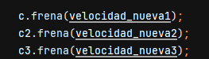
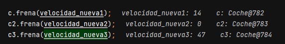

# Ejercicio 1
 
### 1. Explicad QUÈ FA EL MÈTODE MAIN.
-Aquí a cada variable de coche le da unas marcas

-Luego crea unas variables con random hasta 80, y se las añade a cada velocidad

-Aquí a cada aceleración del coche le da una velocidad diferente

-Luego en esta parte a cada velocidad le asigna un numero aleatorio de 1 a 100

-Luego a cada frenada le da el valor anterior random y dependiendo de los valores los coches se imprimirán mas lejos o no.

### 2.  Posad un punt de ruptura (breakpoint) en la línia 27 del mètode main de la classe Principal iesbrineu els valors de les variablesvelocitat_nueva1, velocitat_nueva2 i velocitat_nueva3.Esbrineu també quines dades tenen en els seus paràmetres els cotxes amb variables c,c2 i c3.

### 3.   Posad un punt de ruptura (breakpoint) en la línia 46 del mètode main de la classe Principal i esbrineu els valors de les variables velocitat_nueva1, velocitat_nueva2 i velocitat_nueva3.Esbrineu també quines dades tenen en els seus paràmetres els cotxes amb variables c,c2 i c3.

